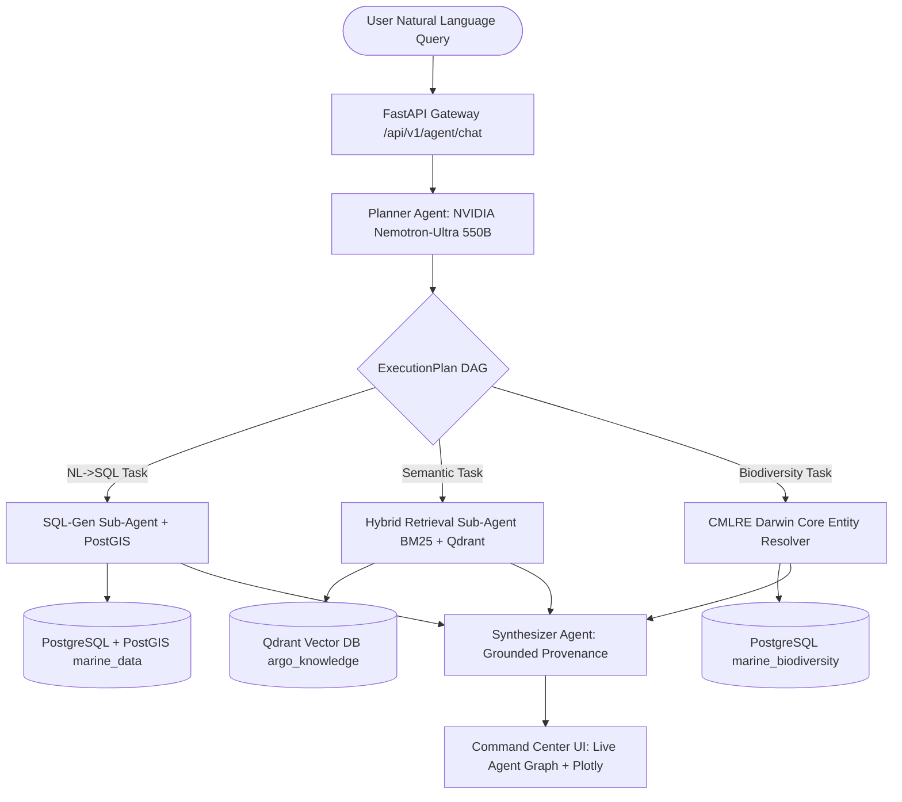

# VARUNA 🌊
### Agentic AI Ocean & Marine Ecosystem Intelligence Platform
**A Unified National Marine Data Backbone Fusing INCOIS Physical Oceanography with CMLRE Living Resources**

[](https://sih.gov.in)
[](https://incois.gov.in)
[](https://cmlre.gov.in)
[](https://openrouter.ai)
[](https://fastapi.tiangolo.com)
[](https://nextjs.org)
[](https://ai.google.dev/)
[](https://postgis.net)

---

## 🏆 Built for the CSI Gemini MLH Hackathon

VARUNA was developed for the **CSI Gemini MLH Hackathon**. It is **not an SIH (CSI Gemini MLH Hackathon) submission**.

The project uses **Gemini API keys** as part of its AI capabilities, alongside the multi-agent, data-engineering, spatial analytics, and machine-learning components described below.

---

## 🌊 Overview

**VARUNA** is an enterprise-grade agentic AI platform that bridges India's two siloed marine data domains:
1. **INCOIS (Hyderabad)** — Real-time physical and chemical sensor profiles (temperature, salinity, oxygen, chlorophyll) from 3,800+ ARGO floats.
2. **CMLRE (Kochi)** — Marine living resources taxonomy, species distributions, and ecosystem biodiversity records.

VARUNA lets oceanographers, disaster cells, and fisheries authorities ask compound natural-language questions across both domains — and **proactively warns** them before marine heatwaves or hypoxic anomalies trigger ecological damage.

---

## ⚡ Key Innovations (Surpassing OceanIQ — SIH 2025 Winner)

```
┌───────────────────────────────────────┬─────────────────────────────────────────────────────────────────────────────┐
│ Capability                            │ Innovation in VARUNA                                                        │
├───────────────────────────────────────┼─────────────────────────────────────────────────────────────────────────────┤
│ 🧠 Multi-Agent Task DAG Planner       │ Decomposes compound multi-hop queries into asynchronous dependency DAGs.     │
│ 🚨 Proactive Anomaly Agent           │ Continuous 6-hr scanner detecting Marine Heatwaves (Hobday 2016) & Hypoxia. │
│ 🐟 CMLRE Darwin Core Fusion           │ Spatio-temporal joins (≤50km, ≤7 days) between float data & marine species. │
│ ⚡ Zero-Local-LLM Architecture        │ Zero GPU baggage; high-speed async OpenRouter NVIDIA Nemotron-550B.         │
│ 🛡️ Strict Zero-Hallucination          │ Every numerical value is strictly traced back to a verified SQL row.        │
│ 🛰️ Military-Grade Command Center      │ Liquid glass dark HUD, Deck.gl WebGL maps, 15+ oceanographic Plotly charts. │
└───────────────────────────────────────┴─────────────────────────────────────────────────────────────────────────────┘
```

---

## 📐 High-Level Architecture



---

## 🚀 Quickstart (Zero-Docker Native Local Setup)

### 1. Backend Setup
```bash
cd backend
python -m venv venv
.\venv\Scripts\Activate.ps1   # Windows (or source venv/bin/activate on Linux/Mac)
pip install -r requirements.txt

# Configure backend/.env (copy from .env.example with your OpenRouter API key)

# Seed 500+ Indian Ocean marine species records
python -m src.ingestion.seed_biodiversity

# Launch FastAPI server
uvicorn main:app --reload --port 8000
```
- API Documentation: `http://localhost:8000/docs`

### 2. Frontend Setup
```bash
cd frontend
npm install
npm run dev
```
- Command Center UI: `http://localhost:3000`

---

## 👥 Team Ctrl Alt Defeat & Assignment Directory

| Member | Name | Role | Specification |
|---|---|---|---|
| **M1** | **Aryan Lomte (Lead)** | AI Systems Architect & Full RAG Lead | [Aryan_Lomte.md](file:///e:/Hackathons/floatchatai-main/docs/assignments/Aryan_Lomte.md) |
| **M2** | **Aditya Yadav** | Data Engineer & Backend Lead | [Aditya_Yadav.md](file:///e:/Hackathons/floatchatai-main/docs/assignments/Aditya_Yadav.md) |
| **M3** | **Sahil Shah** | Predictive ML & Sensor QC Lead | [Sahil_Shah.md](file:///e:/Hackathons/floatchatai-main/docs/assignments/Sahil_Shah.md) |
| **M4** | **Advay Chavan** | Frontend Full-Stack Lead | [Advay_Chavan.md](file:///e:/Hackathons/floatchatai-main/docs/assignments/Advay_Chavan.md) |
| **M5** | **Netal Gupta** | Geospatial Visualization Specialist | [Netal_Gupta.md](file:///e:/Hackathons/floatchatai-main/docs/assignments/Netal_Gupta.md) |
| **M6** | **Kanishka Sahal** | Marine Analytics & Presentation Lead | [Kanishka_Sahal.md](file:///e:/Hackathons/floatchatai-main/docs/assignments/Kanishka_Sahal.md) |

---

## 📚 Complete Technical Documentation

- 📖 **[Master Handbook: VARUNA.md](file:///e:/Hackathons/floatchatai-main/VARUNA.md)**
- 🏛️ **[Architecture Overview](file:///e:/Hackathons/floatchatai-main/docs/architecture/01_SYSTEM_OVERVIEW.md)**
- 🤖 **[Multi-Agent Task DAG Orchestration](file:///e:/Hackathons/floatchatai-main/docs/architecture/02_MULTI_AGENT_ORCHESTRATION.md)**
- 📊 **[NetCDF HPC Extraction & Ingestion Pipeline](file:///e:/Hackathons/floatchatai-main/docs/architecture/03_NETCDF_INGESTION_AND_HPC_ETL.md)**
- 🐟 **[CMLRE Darwin Core Biodiversity Fusion](file:///e:/Hackathons/floatchatai-main/docs/architecture/04_CMLRE_BIODIVERSITY_FUSION.md)**
- 🚨 **[Proactive Anomaly & MHW Early-Warning Engine](file:///e:/Hackathons/floatchatai-main/docs/architecture/05_PROACTIVE_ANOMALY_ENGINE.md)**
- 🗄️ **[Database & Qdrant Vector Schema](file:///e:/Hackathons/floatchatai-main/docs/architecture/06_DATABASE_AND_VECTOR_SCHEMA.md)**
- 🧠 **[OpenRouter Nemotron-550B Cognitive Layer](file:///e:/Hackathons/floatchatai-main/docs/architecture/07_LLM_OPENROUTER_ENGINE.md)**
- 🖥️ **[Frontend Operations Center UI Specification](file:///e:/Hackathons/floatchatai-main/docs/architecture/08_FRONTEND_OPERATIONS_CENTER.md)**
- 🛠️ **[Zero-Docker Local Setup Guide](file:///e:/Hackathons/floatchatai-main/docs/development/01_LOCAL_SETUP_NO_DOCKER.md)**
- 📋 **[API Contracts & Schema Specifications](file:///e:/Hackathons/floatchatai-main/docs/development/04_API_CONTRACTS.md)**
