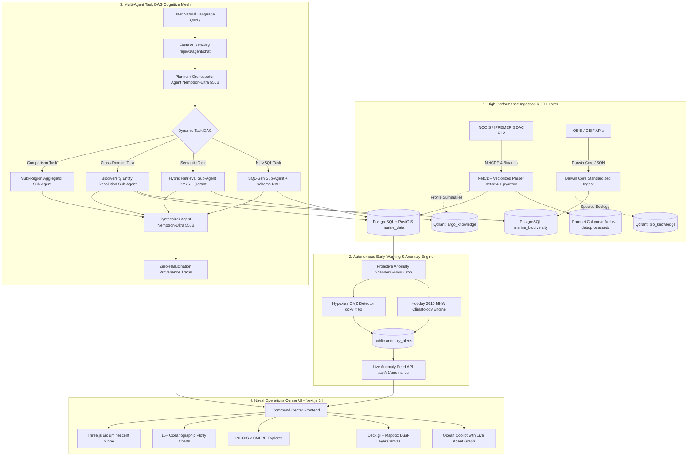

# VARUNA Technical Architecture — 01. System Overview

> **System Designation**: VARUNA (Vedic Deity of Oceans and Cosmic Waters)  
> **Classification**: Agentic AI Ocean & Marine Ecosystem Intelligence Platform  
> **Mandate**: National Marine Data Backbone fusing INCOIS Physical Argo Observations + CMLRE Marine Living Resources  
> **Target Audience**: INCOIS Oceanographers, CMLRE Marine Biologists, State Disaster Management Authorities (SDMAs), Coastal Fisheries Departments  

---

## 1. High-Level System Architecture

VARUNA is architected as an event-driven, multi-agent cognitive mesh that unifies physical oceanographic observations with biological ecosystem data.

---

## 2. Subsystem Descriptions

### Subsystem 1: Dual-Domain Ingestion & Storage Architecture
- **Physical Ocean Stream**: Ingests multi-parameter NetCDF files from INCOIS Argo Float array (temperature, salinity, pressure, dissolved oxygen, chlorophyll-a, nitrate, pH, backscatter).
- **Marine Living Resources Stream**: Normalized using the international Darwin Core standard (`dwc:scientificName`, `dwc:decimalLatitude`, `dwc:decimalLongitude`, `dwc:eventDate`, `dwc:individualCount`).
- **Hybrid Storage Model**:
  - **Relational / Geospatial**: PostgreSQL with PostGIS extension for microsecond spatial filtering (`ST_DWithin`, bounding box indexing).
  - **Columnar Analytics**: Parquet files read via DuckDB for multi-year aggregation queries.
  - **Vector Indices**: Qdrant vector database managing 3 dedicated semantic namespaces.

### Subsystem 2: Proactive Marine Anomaly & Early-Warning Engine
Unlike traditional reactive dashboards, VARUNA runs continuous background statistical scans over physical ocean measurements:
- Identifies **Marine Heatwave (MHW)** precursors using climatological baseline exceedance ($\ge 90\text{th}$ percentile for 5+ days).
- Detects **Oxygen Minimum Zone (OMZ)** expansions ($DOXY < 60\,\mu\text{mol/kg}$) threatening demersal fisheries.
- Automatically maps impacted biological species habitats by intersecting anomaly bounding boxes with Darwin Core occurrence records.

### Subsystem 3: Multi-Agent Task DAG Cognitive Mesh
Replaces single-shot RAG (OceanIQ) with an asynchronous Directed Acyclic Graph (DAG) executor:
- **Planner Agent**: Parses user intent and produces an optimized execution graph.
- **Specialized Sub-Agents**: Dispatched in parallel with topological dependency resolution.
- **Synthesizer Agent**: Merges tabular, spatial, and semantic outputs into scientific prose with verified numeric citations.

### Subsystem 4: Command Center Frontend
A zero-compromise, military/scientific command center UI built in Next.js 14:
- Hardware-accelerated Deck.gl layers rendering 3,800+ active ARGO floats and biodiversity observations.
- Live `AgentGraph` visualization rendering real-time sub-agent execution status and latencies.
- 15+ specialized Plotly chart types including Hovmöller diagrams, T-S curves with UNESCO isopycnals, and 3D bathymetric profiles.
