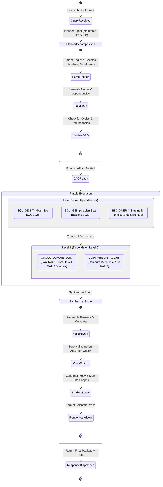

# VARUNA Technical Architecture — 02. Multi-Agent Task DAG Orchestration

---

## 1. The Core Architectural Leap: Single-Shot RAG vs. Multi-Agent Task DAG

Last year's winning solution (**OceanIQ**) utilized a linear single-shot RAG architecture:
$$\text{Query} \xrightarrow{\text{Classify}} \text{Intent} \xrightarrow{\text{Single SQL Generation}} \text{Execute SQL} \xrightarrow{\text{Single LLM Call}} \text{Answer}$$

### Why Single-Shot Fails on Real Marine Governance Queries
Real questions asked by INCOIS oceanographers, fisheries officers, and disaster agencies are inherently compound, multi-temporal, and cross-domain:
> *"Did the April 2026 marine heatwave in the eastern Arabian Sea correlate with a drop in dissolved oxygen and an offshore shift in Indian Oil Sardine (Sardinella longiceps) distribution compared to the 2022 baseline?"*

A single SQL query cannot execute this prompt because:
1. It requires two distinct spatial-temporal aggregation queries on `public.marine_data`.
2. It requires a statistical baseline comparison against a 5-year climatological mean.
3. It requires an entity lookup in `public.marine_biodiversity` for *Sardinella longiceps*.
4. It requires a lateral spatial join ($\Delta r \le 50\text{km}, \Delta t \le 7\text{ days}$) between the biological observations and the physical temperature/oxygen sensors.

---

## 2. VARUNA Multi-Agent Task DAG Engine

VARUNA resolves complex queries via a **Dynamic Task DAG Execution Engine**:



---

## 3. Sub-Agent Specifications

### 3.1 Planner Agent (`backend/src/agents/orchestrator.py`)
- **System Prompt**: Oceanographic task decomposition specialist.
- **Model**: `nvidia/nemotron-ultra-550b-a55b:free` via OpenRouter.
- **Output Schema**:
  ```json
  {
    "plan_id": "plan_9f82b1c4",
    "query": "...",
    "tasks": [
      {
        "task_id": "t1",
        "agent": "SQL_GEN",
        "params": {
          "region": "arabian_sea",
          "variables": ["temp", "doxy", "chla"],
          "time_window": "2026-04-01 to 2026-04-30"
        },
        "dependencies": []
      },
      {
        "task_id": "t2",
        "agent": "BIODIVERSITY",
        "params": {
          "scientific_name": "Sardinella longiceps",
          "region": "arabian_sea"
        },
        "dependencies": []
      },
      {
        "task_id": "t3",
        "agent": "CROSS_DOMAIN_JOIN",
        "params": {
          "bio_task_ref": "t2",
          "ocean_task_ref": "t1",
          "max_distance_km": 50.0,
          "max_days_delta": 7
        },
        "dependencies": ["t1", "t2"]
      },
      {
        "task_id": "t4",
        "agent": "SYNTHESIZER",
        "params": {
          "task_refs": ["t1", "t2", "t3"]
        },
        "dependencies": ["t1", "t2", "t3"]
      }
    ]
  }
  ```

---

### 3.2 SQL-Gen Sub-Agent (`backend/src/agents/sql_gen_agent.py`)
- **Role**: Translates natural language parameters into sanitized PostgreSQL/PostGIS queries.
- **Context Injection**: Uses Qdrant `argo_schema` collection to inject exact column names, QC flag conventions, and bounding box coordinates.
- **Safety Enforcement**: Query must pass through `extract_sql()` and AST validation to guarantee `SELECT`-only semantics before database execution.

---

### 3.3 Biodiversity Entity Resolution Sub-Agent (`backend/src/agents/biodiversity_agent.py`)
- **Role**: Queries `public.marine_biodiversity` for species taxonomic classification, occurrence coordinates, and observation dates.
- **Resolution Core**: Joins species observations to nearest ARGO float profiles using PostGIS spatial indexing (`ST_DWithin`) and temporal bounding (`BETWEEN event_date - 7 AND event_date + 7`).

---

### 3.4 Synthesizer Agent (`backend/src/agents/synthesizer_agent.py`)
- **Role**: Merges tabular SQL rows, species occurrences, and anomaly metrics into a cohesive scientific report.
- **Anti-Hallucination Invariant**: The Synthesizer is strictly instructed:
  > *"Every numeric value (temperature, salinity, distance, count) MUST cite its origin row from the SQL output. If a number was not present in the sub-agent outputs, you are strictly prohibited from generating it."*
