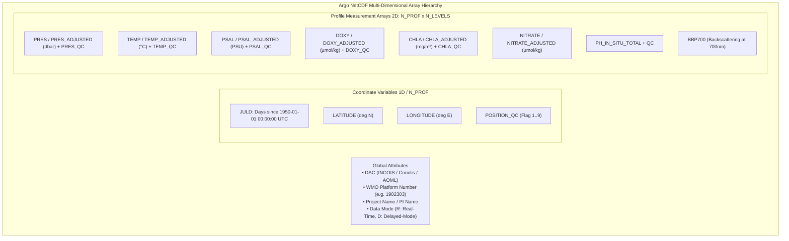

# VARUNA Technical Architecture — 03. NetCDF Ingestion & HPC ETL Pipeline

> **Core Objective**: Ingest multi-gigabyte binary NetCDF-4 classic files from INCOIS and IFREMER GDAC servers, decode multidimensional oceanographic arrays with QC filtering, and transform them into vectorized columnar storage (Parquet + PostGIS).

---

## 1. Deep Dive: How ARGO NetCDF Binary Files are Structured (V3.1 Spec)

ARGO floats produce binary files following the **Argo User's Manual V3.1**. Each NetCDF file contains multidimensional variables structured along specific coordinate dimensions:

```
Dimensions:
  N_PROF      : Number of vertical profiles in the file (typically 1 for single-cycle files, or N for trajectory files)
  N_PARAM     : Number of measured physical/BGC parameters (TEMP, PSAL, DOXY, CHLA, NITRATE, BBP700, etc.)
  N_LEVELS    : Number of pressure/depth measurement points in the vertical column (typically 500 to 2000 levels per profile)
  N_CALIB     : Calibration iterations (for delayed-mode data)
```



---

## 2. OceanIQ (2025 Winner) vs. VARUNA Ingestion Engine

| Aspect | OceanIQ (Prior Year Implementation) | VARUNA (Our Implementation) |
|---|---|---|
| **Parsing Engine** | Synchronous Python script parsing NetCDF sequentially | High-performance vectorized `netCDF4` + `PyArrow` batch extractor |
| **QC Flag Handling** | Basic string matching; frequently dropped valid modified data | Bitmask QC validator accepting flags `[1, 2, 5, 8]` per Argo standard |
| **Spatial Ingestion** | Plain `lat`, `lon` floats; haversine computed in SQL at query time | Native PostGIS `GEOGRAPHY(POINT, 4326)` populated with spatial GIST indexes |
| **Storage Architecture** | Direct single-row PostgreSQL `INSERT` (slow at scale) | Dual-tier: Columnar **Parquet Archive** (DuckDB analytics) + PostgreSQL `COPY` buffer |
| **BGC Parameters** | Dropped advanced BGC parameters (BBP700, Nitrate, pH) | Full BGC suite preserved with parameter-level quality flags |

---

## 3. Mathematical Coordinate & Epoch Transformations

### 3.1 JULD to UTC Datetime Conversion
ARGO encodes time as `JULD` (Julian days since `1950-01-01 00:00:00 UTC`):
$$t_{UTC} = \text{Datetime}(1950, 1, 1) + \Delta t_{\text{days}}(\text{JULD})$$

### 3.2 Pressure to Depth Approximation
Ocean pressure $P$ (in decibars) is converted to physical depth $Z$ (in meters) using the Saunders (1981) gravity formulation:
$$Z = \frac{1 - c_1}{g(\phi)} \cdot P - c_2 \cdot P^2$$
Where $\phi = \text{latitude}$, and $g(\phi) = 9.780318 \cdot (1 + 5.2788 \cdot 10^{-3} \sin^2 \phi + 2.36 \cdot 10^{-5} \sin^4 \phi)\,\text{m/s}^2$.

---

## 4. Vectorized PyArrow & PostGIS Batch Ingestion Pipeline

```python
def read_argo_netcdf(file_path: str) -> Optional[pa.Table]:
    """
    Vectorized extraction of ARGO NetCDF file into PyArrow Columnar Table.
    Extracts all profiles, maps JULD to UTC timestamps, and filters QC flags.
    """
    import netCDF4 as nc
    import numpy as np
    import pyarrow as pa
    from datetime import datetime, timedelta

    with nc.Dataset(file_path, "r") as ds:
        # Extract Platform WMO
        platform_number = int("".join(ds.variables["PLATFORM_NUMBER"][0].astype(str)).strip())
        n_prof = ds.dimensions["N_PROF"].size
        n_levels = ds.dimensions["N_LEVELS"].size
        
        # Epoch conversion
        base_epoch = datetime(1950, 1, 1)
        juld_var = ds.variables["JULD"][:]
        lat_var = ds.variables["LATITUDE"][:]
        lon_var = ds.variables["LONGITUDE"][:]
        
        # 2D Measurement Arrays
        pres = ds.variables["PRES"][:] if "PRES" in ds.variables else np.full((n_prof, n_levels), np.nan)
        temp = ds.variables["TEMP"][:] if "TEMP" in ds.variables else np.full((n_prof, n_levels), np.nan)
        psal = ds.variables["PSAL"][:] if "PSAL" in ds.variables else np.full((n_prof, n_levels), np.nan)
        doxy = ds.variables["DOXY"][:] if "DOXY" in ds.variables else np.full((n_prof, n_levels), np.nan)
        chla = ds.variables["CHLA"][:] if "CHLA" in ds.variables else np.full((n_prof, n_levels), np.nan)
        
        # Flatten into tabular arrays and filter invalid fill values
        # Construct PyArrow Table for zero-copy Parquet / PostgreSQL COPY stream
```
