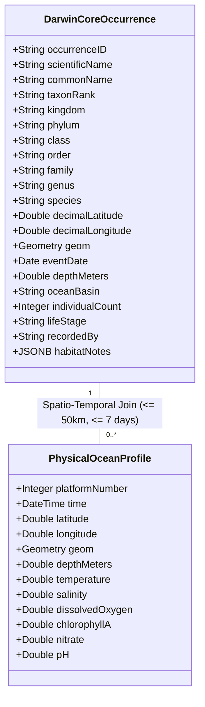
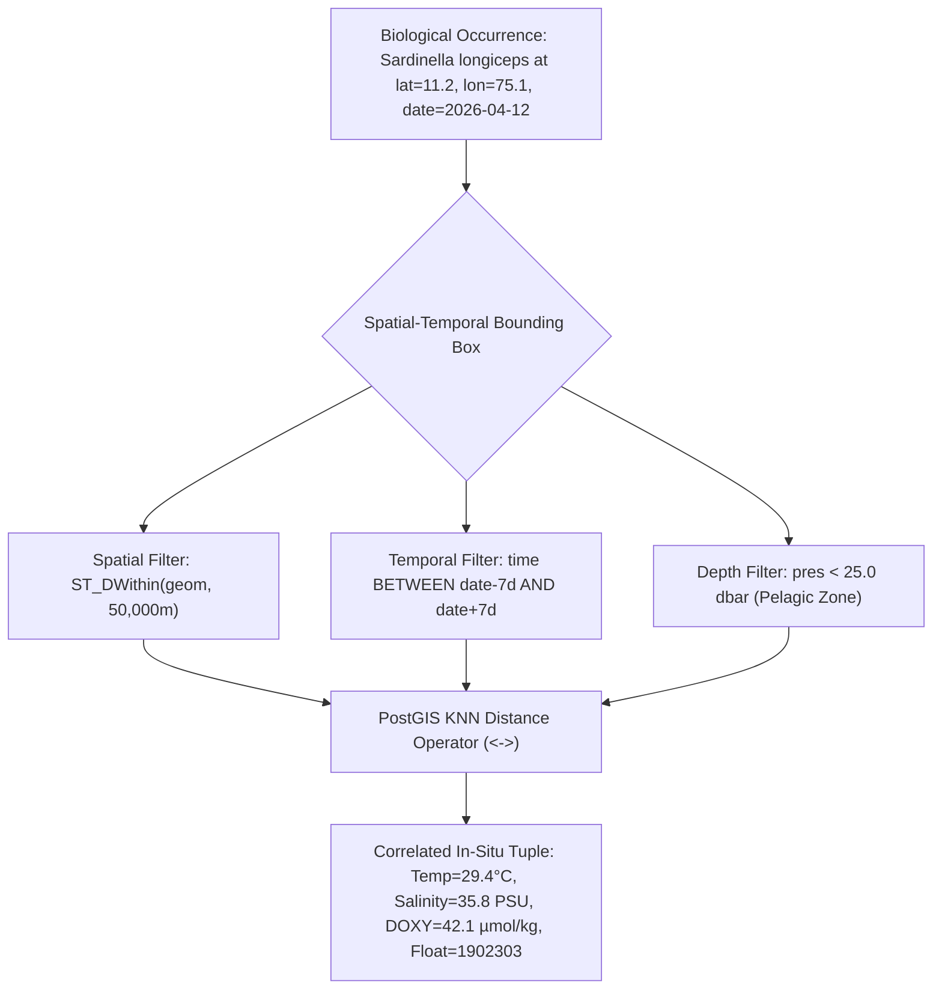

# VARUNA Technical Architecture — 04. CMLRE Marine Living Resources & Biodiversity Fusion

> **Core Objective**: Bridge the foundational gap between INCOIS physical oceanographic data and CMLRE marine living resources data through standardized Darwin Core ingestion and spatial-temporal entity resolution.

---

## 1. The Cross-Domain Governance Problem

In the Indian oceanographic data ecosystem:
- **INCOIS (Hyderabad)** holds real-time physical/chemical ocean data (temperature, salinity, oxygen from ARGO floats, moored buoys, satellites).
- **CMLRE (Kochi)** holds taxonomy, otolith morphology, and eDNA biodiversity data on India's marine living resources.

Before VARUNA, **no unified data bridge existed**. A marine scientist or policy maker asking:
> *"How did the 2026 Arabian Sea marine heatwave impact the migration of Indian Oil Sardines and coral bleaching in the Gulf of Mannar?"*
had to manually download NetCDF files from INCOIS, query isolated taxonomic spreadsheets from CMLRE, and manually align coordinates in GIS software.

---

## 2. Darwin Core Metadata Standardization

To ensure compliance with international biodiversity informatics (TDWG) and seamless compatibility with CMLRE's internal schema, VARUNA standardizes all biological observations into **Darwin Core (DwC)** format:

---

## 3. Spatial-Temporal Cross-Domain Entity Resolution Algorithm

To join a discrete biological occurrence $(x_{bio}, y_{bio}, t_{bio})$ with continuous oceanographic profile measurements $(x_{argo}, y_{argo}, t_{argo}, z)$, VARUNA implements an asynchronous **Spatial-Temporal Bounding Join**:

### Mathematical Formulation
A match is formed if and only if:
$$\mathcal{D}_{\text{geodesic}}(\mathbf{x}_{bio}, \mathbf{x}_{argo}) \le 50.0\,\text{km}$$
$$|t_{bio} - t_{argo}| \le 7\,\text{days}$$
$$z_{argo} \le z_{\text{max\_habitat}}(\text{taxon})$$

---

## 4. Key Indian Ocean Marine Species Integrated

| Scientific Name | Common Name | Habitat Basin | Critical Ocean Variables Correlated |
|---|---|---|---|
| *Sardinella longiceps* | Indian Oil Sardine | Arabian Sea, Malabar Coast | SST ($22-26^\circ\text{C}$ optimum), Upwelling Chlorophyll-a |
| *Rastrelliger kanagurta* | Indian Mackerel | Bay of Bengal, Lakshadweep | Surface Salinity, Dissolved Oxygen ($> 60\,\mu\text{mol/kg}$) |
| *Acropora millepora* | Staghorn Coral | Gulf of Mannar, Andaman Islands | Sea Surface Temperature (Bleaching threshold $> 30.5^\circ\text{C}$) |
| *Thunnus albacares* | Yellowfin Tuna | Equatorial Indian Ocean | Thermocline depth ($100-200\text{m}$), Dissolved Oxygen |
| *Trichodesmium erythraeum* | Blue-green Algae | Surface Arabian Sea | Water Temperature, Nitrogen / Phosphate ratio |
| *Dugong dugon* | Dugong (Sea Cow) | Gulf of Mannar Seagrass | Coastal Water Clarity (BBP700), Salinity |
