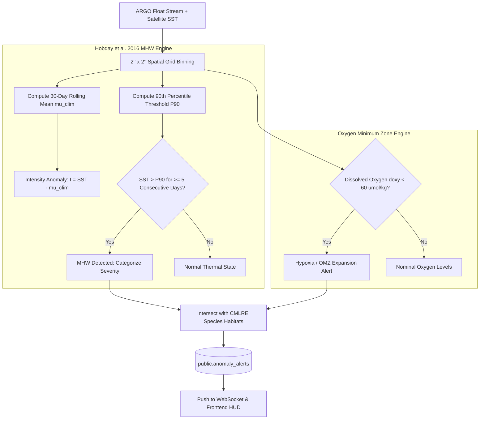

# VARUNA Technical Architecture — 05. Proactive Marine Anomaly & Early-Warning Engine

> **The Centerpiece Differentiator**: Autonomous background intelligence that scans the physical and BGC ocean stream to detect Marine Heatwaves (MHWs), hypoxic Oxygen Minimum Zone (OMZ) expansions, and thermal coral bleaching risks before they escalate into ecological disasters.

---

## 1. Why Proactive Detection Matters for Marine Governance

Traditional ocean portals are **purely reactive**: they display charts only when an expert manually crafts a query. 

In April 2026, INCOIS issued heatwave alerts across 6 ocean basins. In 2020, an undetected marine heatwave bleached **85% of corals in the Gulf of Mannar** and forced pelagic fish stocks to retreat into deeper, hypoxic waters, severely impacting 30+ million coastal fishing livelihoods.

VARUNA solves this governance gap by implementing an **autonomous anomaly agent** running continuous statistical scans over incoming float and satellite streams.

---

## 2. Statistical & Climatological Anomaly Foundations



---

## 3. Mathematical Formulations

### 3.1 Marine Heatwave Intensity & Category (Hobday et al. 2016)
Let $T(x, y, t)$ be the sea surface temperature at location $(x, y)$ on day $t$.
$$\Delta T(x, y, t) = T(x, y, t) - \mu_{\text{clim}}(x, y, t)$$
$$\text{Threshold Exceedance: } E(x, y, t) = T(x, y, t) - P_{90}(x, y, t)$$

A Marine Heatwave is officially declared when:
$$E(x, y, t) > 0 \quad \forall t \in [t_{\text{start}}, t_{\text{start}} + D], \quad D \ge 5\text{ days}$$

#### Category Classification:
- **Category I (Moderate)**: $1.0 \times \text{Threshold} \le \Delta T < 2.0 \times \text{Threshold}$
- **Category II (Strong)**: $2.0 \times \text{Threshold} \le \Delta T < 3.0 \times \text{Threshold}$
- **Category III (Severe)**: $3.0 \times \text{Threshold} \le \Delta T < 4.0 \times \text{Threshold}$
- **Category IV (Extreme)**: $\Delta T \ge 4.0 \times \text{Threshold}$

---

### 3.2 Hypoxia & Suboxia Thresholds
- **Hypoxia Threshold**: $\text{DOXY} < 60.0\,\mu\text{mol/kg}$ (Limits pelagic fish respiration).
- **Suboxia Threshold**: $\text{DOXY} < 20.0\,\mu\text{mol/kg}$ (Triggers mass mortality of demersal species).
- **Anoxia Threshold**: $\text{DOXY} = 0.0\,\mu\text{mol/kg}$ (Complete absence of oxygen).

---

## 4. Alert Dispatch Schema (`public.anomaly_alerts`)

```sql
CREATE TABLE IF NOT EXISTS public.anomaly_alerts (
    id               BIGSERIAL PRIMARY KEY,
    alert_type       VARCHAR(64) NOT NULL, -- 'MARINE_HEATWAVE' | 'HYPOXIA' | 'CHLOROPHYLL_BLOOM'
    severity         VARCHAR(32) NOT NULL, -- 'CRITICAL' | 'HIGH' | 'MODERATE' | 'ADVISORY'
    ocean_basin      VARCHAR(64) NOT NULL, -- 'arabian_sea' | 'bay_of_bengal' | 'gulf_of_mannar'
    lat_min          DOUBLE PRECISION NOT NULL,
    lat_max          DOUBLE PRECISION NOT NULL,
    lon_min          DOUBLE PRECISION NOT NULL,
    lon_max          DOUBLE PRECISION NOT NULL,
    metric_value     DOUBLE PRECISION NOT NULL, -- e.g. +3.4°C SST anomaly
    baseline_value   DOUBLE PRECISION NOT NULL, -- e.g. 28.1°C climatological mean
    detected_at      TIMESTAMPTZ DEFAULT NOW(),
    active           BOOLEAN DEFAULT TRUE,
    affected_species JSONB,                     -- Array of vulnerable species names + impact notes
    policy_advisory  TEXT,                      -- Pre-formatted text for fisheries officers
    created_at       TIMESTAMPTZ DEFAULT NOW()
);

CREATE INDEX IF NOT EXISTS idx_anomaly_basin_active ON public.anomaly_alerts (ocean_basin, active);
```
