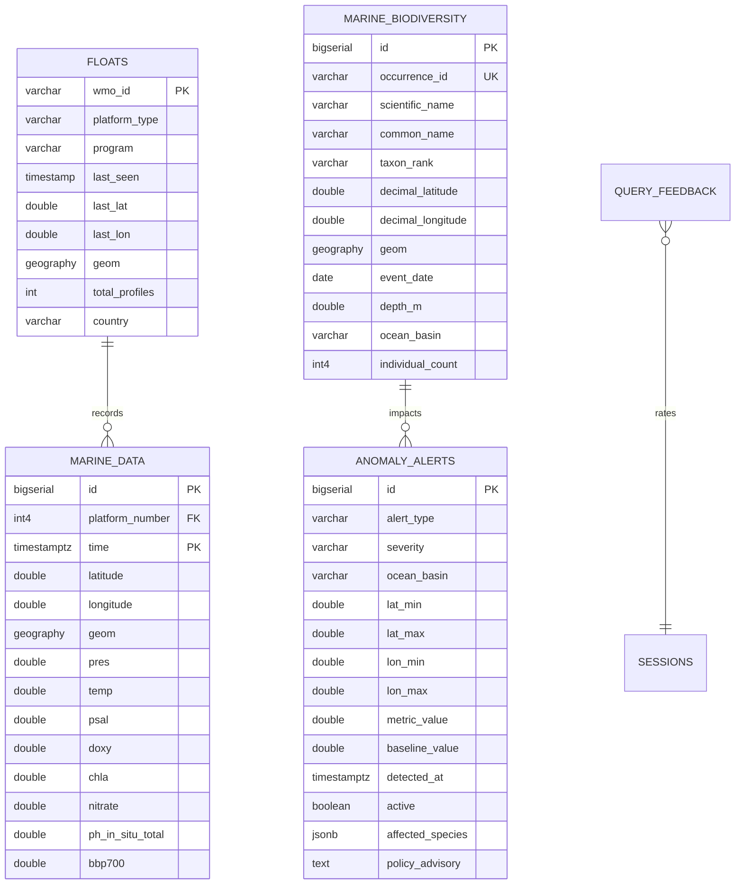
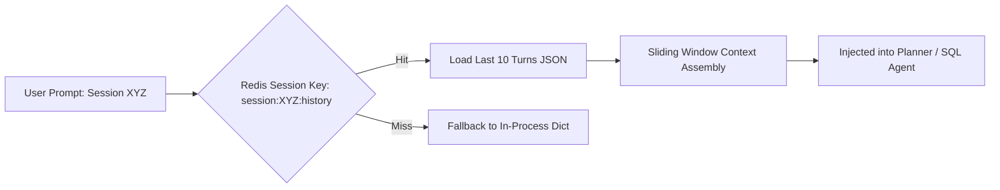

# VARUNA Technical Architecture — 06. Database & Vector Schema

> **Storage Topology**: PostgreSQL with PostGIS extension (relational/spatial), Qdrant Vector Engine (3 semantic namespaces), DuckDB (columnar Parquet analytics), and Redis (session memory).

---

## 1. Relational & Geospatial Schema (PostgreSQL + PostGIS)



---

## 2. Table DDLs & Indexing Strategies

### 2.1 Partitioned Physical Ocean Measurements (`public.marine_data`)
```sql
CREATE TABLE IF NOT EXISTS public.marine_data (
    id               BIGSERIAL,
    platform_number  INT4 NOT NULL,
    time             TIMESTAMPTZ NOT NULL,
    latitude         DOUBLE PRECISION NOT NULL,
    longitude        DOUBLE PRECISION NOT NULL,
    geom             GEOGRAPHY(POINT, 4326),
    pres             DOUBLE PRECISION,
    pres_qc          SMALLINT DEFAULT 1,
    temp             DOUBLE PRECISION,
    temp_qc          SMALLINT DEFAULT 1,
    psal             DOUBLE PRECISION,
    psal_qc          SMALLINT DEFAULT 1,
    doxy             DOUBLE PRECISION,
    doxy_qc          SMALLINT DEFAULT 1,
    chla             DOUBLE PRECISION,
    nitrate          DOUBLE PRECISION,
    ph_in_situ_total DOUBLE PRECISION,
    bbp700           DOUBLE PRECISION,
    cycle_number     INT4,
    data_mode        CHAR(1) DEFAULT 'R',
    PRIMARY KEY (id, time)
) PARTITION BY RANGE (time);

-- Year Partitions (2020 through 2026)
CREATE TABLE IF NOT EXISTS marine_data_2024 PARTITION OF public.marine_data
    FOR VALUES FROM ('2024-01-01 00:00:00+00') TO ('2025-01-01 00:00:00+00');
CREATE TABLE IF NOT EXISTS marine_data_2025 PARTITION OF public.marine_data
    FOR VALUES FROM ('2025-01-01 00:00:00+00') TO ('2026-01-01 00:00:00+00');
CREATE TABLE IF NOT EXISTS marine_data_2026 PARTITION OF public.marine_data
    FOR VALUES FROM ('2026-01-01 00:00:00+00') TO ('2027-01-01 00:00:00+00');

-- Indexes
CREATE INDEX IF NOT EXISTS idx_marine_geom ON public.marine_data USING GIST (geom);
CREATE INDEX IF NOT EXISTS idx_marine_time_platform ON public.marine_data (platform_number, time DESC);
CREATE INDEX IF NOT EXISTS idx_marine_pres ON public.marine_data (pres);
```

---

## 3. Vector Database Architecture (Qdrant 3-Collection Topology)

| Collection | Vector Dimension | Distance Metric | Content & Schema |
|---|---|---|---|
| `argo_knowledge` | 768-dim / 1536-dim | Cosine | Natural-language profile summary texts (WMO ID, date, location, surface temp, mixed layer depth, thermocline gradient) |
| `argo_schema` | 768-dim / 1536-dim | Cosine | PostgreSQL table schemas, column descriptions, and 50+ curated NL→SQL few-shot examples |
| `bio_knowledge` | 768-dim / 1536-dim | Cosine | Species habitat descriptions, ecological niches, thermal tolerances, and CMLRE taxonomy literature |

---

## 4. Redis Multi-Turn Conversation & Working Memory


