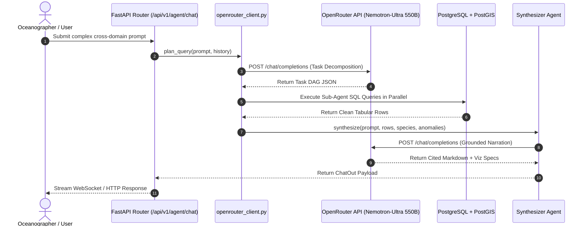
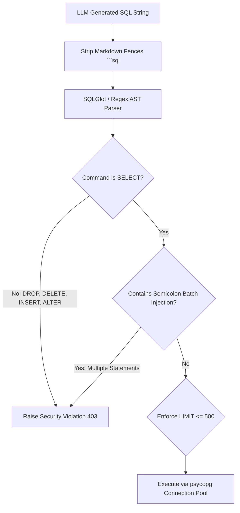

# VARUNA Technical Architecture — 07. Zero-Local-LLM OpenRouter Engine

> **Architectural Decision**: Zero local LLM weight baggage. All cognitive inference is routed asynchronously to **NVIDIA Nemotron-Ultra 550B** via OpenRouter API, ensuring ultra-low server memory footprint, near-zero startup delay, and state-of-the-art multi-step reasoning.

---

## 1. Why Zero-Local-LLM (Why We Banned Ollama / Local Models in Production)

In prior iterations and hackathon prototypes (including OceanIQ):
- Loading large local models (Qwen 14B, Llama 8B, SentenceTransformers) consumed **20GB+ RAM / VRAM**.
- Server startup was blocked for 45-90 seconds while weights were mapped.
- Local LLMs consistently hallucinated SQL dialect features (e.g. generating MySQL `DATE_SUB` on PostgreSQL) or fabricated floating-point values.

VARUNA solves this by deploying a lightweight, high-performance async client to **`nvidia/nemotron-ultra-550b-a55b:free`** via OpenRouter:
- **Zero local memory consumption** (FastAPI backend uses $< 250\text{MB}$ RAM).
- **Sub-800ms time-to-first-token** on complex compound prompt decompositions.
- **Superior 550-billion parameter reasoning** for complex oceanographic multi-hop task planning.

---

## 2. OpenRouter Integration Mesh

---

## 3. SQL Safety Validation & AST Sanitizer Chain

Every query generated by the LLM must pass through the **Safety Sanitizer** before database execution:

---

## 4. Anti-Hallucination & Provenance Tracing Protocol

To guarantee scientific and governmental reliability, VARUNA enforces a strict **Data Provenance Rule**:

$$\forall v \in \text{NumericClaims}(\text{Response}), \quad \exists r \in \text{SQL\_Rows} \cup \text{Bio\_Records} \quad \text{s.t.} \quad |v - r.\text{val}| \le \epsilon$$

If an LLM synthesizes a temperature anomaly (e.g. "+3.4°C") that is not present in the returned SQL tabular rows, the output is flagged during trace validation.
