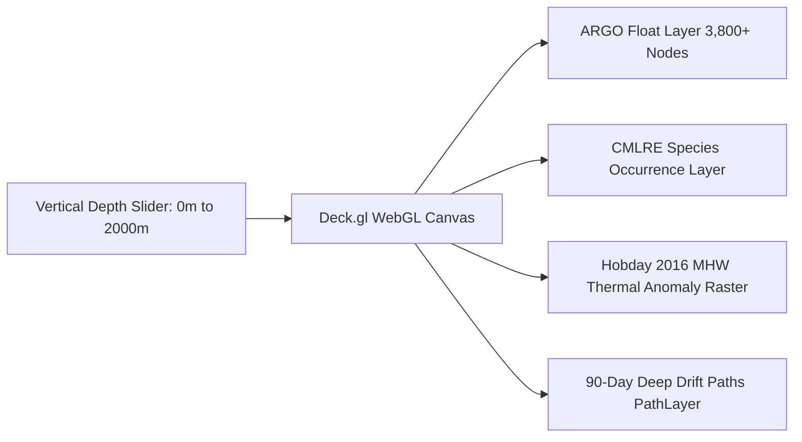
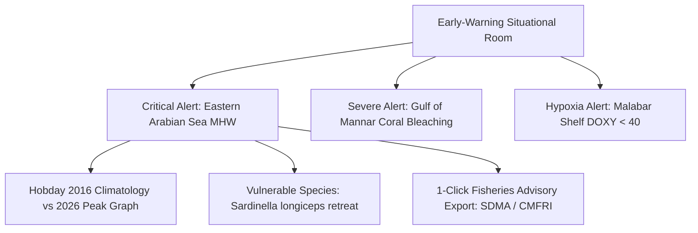
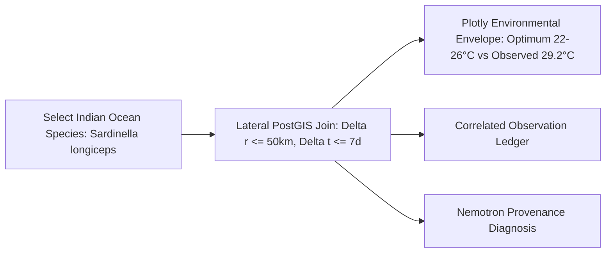

# VARUNA Technical Architecture — 08. Frontend Operations Center: The Oceanographer’s Tactical Command Center

> **Design Aesthetic**: Military/Scientific Marine Operations Center with Liquid Glass HUD and Bioluminescent Telemetry.  
> **Narrative Core**: Directly driven by the high-stakes crises documented in the [VARUNA Master Guide](file:///e:/Hackathons/floatchatai-main/VARUNA_Final_PS_Master_Guide.md) (April 2026 6-basin Marine Heatwave Alerts, 2020 Gulf of Mannar 85% coral bleaching catastrophe, 30M coastal livelihoods exposed to fish retreat, MoES National Marine Data Backbone).  
> **Key Frameworks**: Next.js 14 (App Router), Deck.gl v9, Mapbox GL JS v3, Three.js, React-Plotly.js, Framer Motion, TailwindCSS v3.

---

## 1. Tactical Command Center Layout & Master Wireframe

```
╔═══════════════════════════════════════════════════════════════════════════════════════════════════════════════╗
║  🌊 VARUNA  |  NATIONAL MARINE DATA BACKBONE  |  INCOIS ⇄ CMLRE  [SEC-OPS STATUS: NOMINAL]     ║
╠═══════════════════════════════════════════════════════════════════════════════════════════════════════════════╣
║                                                                                                               ║
║  ┌───────────────────────────┐  ┌──────────────────────────────────────────────────┐  ┌────────────────────┐  ║
║  │ 🛰️ SITUATIONAL MAP CANVAS │  │ 🔬 OCEANOGRAPHIC LAB / CROSS-DOMAIN EXPLORER     │  │ 🤖 OCEAN COPILOT   │  ║
║  │                           │  │                                                  │  │                    │  ║
║  │ • 3,842 ARGO Float Nodes  │  │  [T-S Diagram] [Hovmöller] [BGC] [Species Env]   │  │ [Live Agent DAG]   │  ║
║  │ • CMLRE Species Layer     │  │  ┌────────────────────────────────────────────┐  │  │ ┌────────────────┐ │  ║
║  │ • MHW Heatmap Overlay     │  │  │ 2026 Arabian Sea Thermal Stratification    │  │  │ │ Planner Agent  │ │  ║
║  │ • Drift Trajectories (90d)│  │  │ Temp Anomaly: +3.2°C | DOXY: 38 µmol/kg   │  │  │ └───────┬────────┘ │  ║
║  │                           │  │  │ Sardinella habitat compression: 72%        │  │  │    ┌────┴────┐     │  ║
║  │ [Depth Slider: 0-2000m]   │  │  └────────────────────────────────────────────┘  │  │   SQL       Bio    │  ║
║  └───────────────────────────┘  └──────────────────────────────────────────────────┘  └────────────────────┘  ║
║                                                                                                               ║
║  ┌─────────────────────────────────────────────────────────────────────────────────────────────────────────┐  ║
║  │ 🚨 PROACTIVE ANOMALY TICKER: [CRITICAL MHW - ARABIAN SEA +3.4°C] [HYPOXIA - MALABAR SHELF DOXY < 40]   │  ║
║  └─────────────────────────────────────────────────────────────────────────────────────────────────────────┘  ║
╚═══════════════════════════════════════════════════════════════════════════════════════════════════════════════╝
```

---

## 2. The Four Narrative-Driven Operational Modes

### Mode 1: The Situational Ocean Map & Depth Slicer (`MAP`)
*The anchor screen: Situational awareness across the Indian Ocean basin.*



#### Oceanologist Heaven Features:
1. **Vertical Depth Slicer (0m to 2000m)**:
   - A vertical depth gauge slider on the map edge. Scrubbing down from $0\text{m}$ (Surface Epipelagic) $\to 200\text{m}$ (Mesopelagic/Thermocline) $\to 1000\text{m}$ (Bathypelagic) dynamically filters the float readings, reveals the **Oxygen Minimum Zone (OMZ) core layer**, and shows how surface heatwaves dissipate with depth.
2. **Dual-Layer Toggle (Physical vs Biological)**:
   - **Aqua Nodes**: ARGO physical floats (color-scaled by surface temperature or salinity).
   - **Bioluminescent Nodes**: CMLRE species occurrences (Fish, Corals, Marine Mammals, Phytoplankton).
   - Hovering over any species node shows its **distance to the nearest ARGO float** and in-situ temperature.
3. **Drift Vectors & Trajectories**:
   - Shows the actual 10-day surfacing cycle and 90-day underwater drift track for any selected float (e.g., Float `1902303`).

---

### Mode 2: The Proactive Early-Warning & Heatwave Room (`ALERTS`)
*Directly solving the governance crisis: "Lack of real-time integration into fisheries policy weakens heatwave response."*



#### Narrative Anchor:
- Shows the **April 2026 6-Basin Heatwave Alert** and compares it directly against the **2020 Gulf of Mannar 85% Coral Bleaching Catastrophe**.
- **Real-Time Climatological Threshold Curves**: Renders the 30-year baseline mean $\mu_{clim}$, the 90th percentile threshold $P_{90}$, and the current year's temperature curve showing exact exceedance days ($N \ge 5\text{ days}$).
- **Fisheries Impact Badges**: Calculates thermal habitat compression (e.g., *"Sardine schooling depth compressed to 45–60m due to surface warming above 29.5°C"*).
- **One-Click Policy Dispatch**: Generates formatted advisories for State Disaster Management Authorities and coastal fishing cooperatives.

---

### Mode 3: The INCOIS ↔ CMLRE Cross-Domain Explorer (`BIODIVERSITY`)
*The centerpiece demonstration of the "National Marine Data Backbone" requested by MoES.*



#### What Marine Biologists Will Love:
1. **Thermal Envelope Visualizer**:
   - Plots the species' known biological tolerance envelope (e.g., *Sardinella longiceps* optimum: $22^\circ\text{C} - 26^\circ\text{C}$, lethal: $> 30^\circ\text{C}$) overlaid with real-time ARGO temperature readings at matching coordinates.
2. **Species-to-Float Distance Provenance**:
   - Every correlation clearly displays: *"Correlated with Float WMO 1902303 at 14.2°N, 71.8°E (18.4 km distance, +2 days delta)"*.
3. **Otolith & eDNA Architecture Viewer**:
   - Displays Darwin Core standardized records with a clean badge: *"Demonstrated with OBIS/GBIF Indian Ocean public data — architected for CMLRE national database integration."*

---

### Mode 4: The Deep Oceanographic Laboratory (`ANALYSIS`)
*The ultimate playground for physical and BGC oceanographers with 15+ specialized Plotly charts.*

| Chart Component | Oceanographic Purpose | Visual Style |
|---|---|---|
| **`TSIsopycnals.tsx`** | Temperature-Salinity diagram with background **UNESCO potential density $\sigma_\theta$ isopycnal curves** (identifies Arabian Sea High Salinity Water vs Bay of Bengal Low Salinity Water). | Dark navy canvas, cyan density contours, gradient depth scatter points. |
| **`HovmollerDiagram.tsx`** | Depth vs Time contour diagram ($0-2000\text{m}$ inverted y-axis, months on x-axis) showing seasonal thermocline deepening and upwelling. | Smooth thermal gradient contour (Deep blue $\to$ Cyan $\to$ Coral red). |
| **`DepthProfile.tsx`** | Multi-variable vertical cast ($T, S, \text{DOXY}, \text{CHLA}$ vs Depth) with mixed layer depth (MLD) indicator line. | High-contrast kinetic line graphs with depth gridlines. |
| **`Surface3D.tsx`** | 3D bathymetric mesh showing temperature/salinity gradients across latitude and longitude. | WebGL 3D wireframe mesh with bioluminescent elevation. |
| **`ChlaNitrateScatter.tsx`** | BGC nutrient stoichiometry (Nitrate vs Chlorophyll-a) evaluating ocean productivity and phytoplankton blooms. | Scatter plot with Redfield ratio line ($N:P = 16:1$). |
| **`WindRose.tsx`** | Monsoon wind & surface current directional polar histogram. | Polar compass coordinate rose with intensity bins. |

---

## 3. The Ocean Copilot & Live Multi-Agent DAG Studio

When the user asks a compound question in the chat panel, they see the **Multi-Agent Task DAG executing live**:

```
┌────────────────────────────────────────────────────────────────────────┐
│  🤖 VARUNA MULTI-AGENT REASONING ENGINE                                │
│  Query: "Compare BGC in Arabian Sea vs Equator and show sardine shift" │
├────────────────────────────────────────────────────────────────────────┤
│                                                                        │
│  [1. Planner Agent] ─────────── 180ms  ✓ Generated 4-Node Task DAG    │
│         │                                                              │
│         ├── [2A. SQL-Gen Sub-Agent] ─── 420ms ✓ Ingested 184 ARGO rows │
│         │                                                              │
│         ├── [2B. SQL-Gen Sub-Agent] ─── 390ms ✓ Equator baseline rows │
│         │                                                              │
│         └── [2C. Bio-Entity Sub-Agent]  150ms ✓ Joined 42 Occurrences │
│                    │                                                   │
│  [3. Synthesizer Agent] ─────── 540ms  ✓ Provenance Citation Verified  │
│                                                                        │
├────────────────────────────────────────────────────────────────────────┤
│  ⚡ Total Pipeline Latency: 1.42s | Model: NVIDIA Nemotron-Ultra 550B │
└────────────────────────────────────────────────────────────────────────┘
```

- **Inspectable SQL Drawer**: Oceanographers can click `<> Show Generated SQL` to view the exact sanitized PostGIS query, verify column names, and click `Run in SQL Console` or `Copy`.
- **Zero-Hallucination Badges**: Every numerical metric in the response has a small green badge `[WMO: 1902303 | Row #14]` linking directly to the sensor record.

---

## 4. Visual & Aesthetic Architecture

1. **Color Palette**:
   - `var(--bg)`: `#071A2D` (Midnight Water — deepest ocean background)
   - `var(--bg-1)`: `#0A2540` (Deep Ocean Blue — container glass)
   - `var(--accent)`: `#2EE6C6` (Tropical Aqua — interactive sensors)
   - `var(--glow)`: `#00FFC6` (Bioluminescent Green — AI cognitive pathways)
   - `var(--coral)`: `#FF7F50` (Coral Orange — heatwave anomalies)
   - `var(--coral-dim)`: `#FF6B6B` (Reef Red — hypoxia/suboxia warnings)

2. **Liquid Glass (`.glass` & `.glass-strong`)**:
   - Real physical edge refraction with inset light highlights: `box-shadow: inset 0 1px 0 rgba(255,255,255,0.08), 0 16px 40px rgba(0,0,0,0.4)`.

3. **Typography**:
   - **Numbers & Float IDs**: `Geist Mono` / `JetBrains Mono` for crisp, telemetry-grade readings.
   - **Prose & Insights**: `Inter` / `Geist Sans` with balanced line heights.
