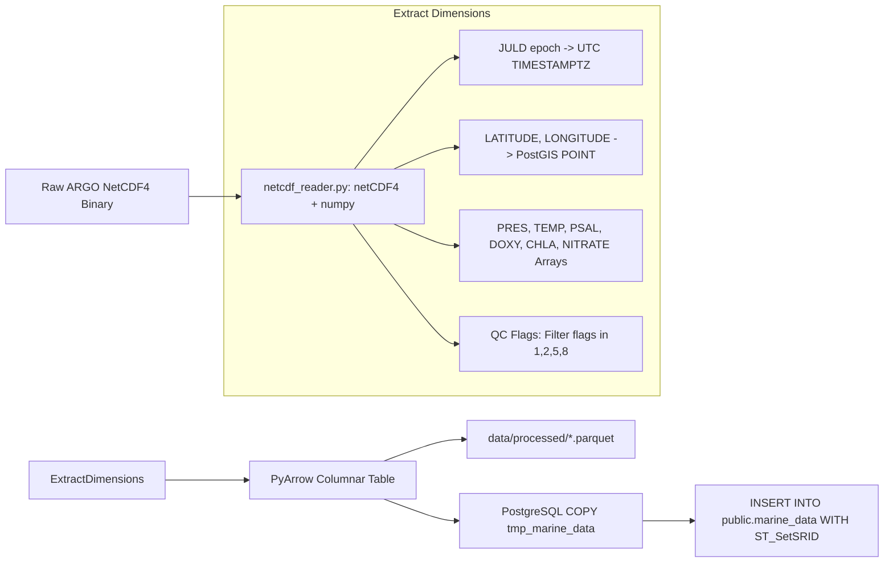

# Member 2: Aditya Yadav (Backend & Data Infrastructure Lead)
**Role**: Data Engineer & Backend Infrastructure Lead  
**Focus Areas**: NetCDF HPC Extraction, PyArrow & Parquet Columnar Storage, PostgreSQL PostGIS Spatial Layer, CMLRE Darwin Core Seeding, Auth & Security  

---

## 1. Executive Summary & Ownership Boundaries
Member 2 owns the raw data ingestion pipeline, spatial relational database schema, and biodiversity dataset seeding for VARUNA:
1. **NetCDF Ingestion Engine**: High-performance extraction of ARGO multi-dimensional float arrays (`N_PROF`, `N_PARAM`, `N_LEVELS`) from IFREMER / INCOIS GDAC servers, resolving Data Assembly Centre (DAC) metadata and sensor QC flags.
2. **PostgreSQL & PostGIS Database Schema**: Production table architecture for `public.marine_data`, `public.marine_biodiversity`, `public.floats`, and `public.anomaly_alerts`, including range partitioning by year and GIST spatial indexing.
3. **CMLRE Marine Living Resources Seed Pipeline**: Ingesting and formatting 500+ Indian Ocean marine species occurrences according to the TDWG Darwin Core standard (`dwc:scientificName`, `dwc:decimalLatitude`, `dwc:eventDate`).
4. **Spatial-Temporal Join Acceleration**: Optimized PostGIS queries (`ST_DWithin`, KNN `<->` spatial operator) for correlating physical ocean float measurements with biological species distributions.

---

## 2. Work Allocation: What to Review vs. What to Build

### 🔍 What to REVIEW (Existing Code — Requires Heavy/High Critical Review)
1. **`src/database/postgres.py` [HIGH REVIEW]**:
   - Check connection pool resilience when running in offline/local environments without PostgreSQL.
   - Verify that spatial geography columns use SRID 4326 and that GIST indexes are properly leveraged during distance queries.
   - Ensure parameterized execution on all functions (zero f-string SQL).
2. **`src/ingestion/netcdf_reader.py` [HEAVY REVIEW]**:
   - Verify array dimension slicing for multi-profile files (`N_PROF > 1`).
   - Validate that JULD epoch calculation (`1950-01-01`) properly handles float time offsets.
   - Verify that sensor QC flags in `[1, 2, 5, 8]` are preserved while bad data flags `[3, 4, 9]` are converted to `NULL`.
3. **`src/ingestion/pipeline.py` [HIGH REVIEW]**:
   - Inspect PostgreSQL `COPY` buffer mechanism and verify temporary staging table handles primary key collisions gracefully (`ON CONFLICT DO NOTHING`).
4. **`src/database/duckdb_client.py` [HIGH REVIEW]**:
   - Review Parquet query performance and verify that memory limits are respected.

### 🔨 What to BUILD (New Code)
1. **`src/ingestion/seed_biodiversity.py` [COMPLETELY NEW]**:
   - Author complete seeder script inserting 500+ Indian Ocean species occurrences (*Sardinella longiceps*, *Rastrelliger kanagurta*, *Acropora millepora*, *Thunnus albacares*, *Dugong dugon*) with valid Darwin Core columns and spatial coordinates.
2. **`init_biodiversity_schema()` in `postgres.py` [COMPLETELY NEW]**:
   - DDL for `public.marine_biodiversity` with GIST index on `geom` and B-tree index on `(scientific_name, event_date)`.
3. **`correlate_species_with_ocean()` in `postgres.py` [COMPLETELY NEW]**:
   - Lateral join query finding nearest ARGO profiles within 50km and 7 days.

---

## 3. Technical Specifications & Implementation Blueprints

### 3.1 NetCDF Dimensionality & QC Masking ETL



#### QC Flag Interpretation Matrix:
| Flag | Meaning | Action in Ingestion |
|---|---|---|
| `1` | Good data | Ingest directly |
| `2` | Probably good | Ingest directly |
| `3` | Bad data that are potentially correctable | Drop parameter value (set to NULL) |
| `4` | Bad data | Drop parameter value (set to NULL) |
| `5` | Value modified | Ingest directly |
| `8` | Estimated value | Ingest with QC annotation |
| `9` | Missing value | Drop parameter value |

---

### 3.2 CMLRE Biodiversity Schema (`public.marine_biodiversity`)

```sql
CREATE TABLE IF NOT EXISTS public.marine_biodiversity (
    id                BIGSERIAL PRIMARY KEY,
    occurrence_id     VARCHAR(128) UNIQUE NOT NULL,
    scientific_name   VARCHAR(255) NOT NULL,
    common_name       VARCHAR(255),
    taxon_rank        VARCHAR(64) DEFAULT 'Species',
    kingdom           VARCHAR(64) DEFAULT 'Animalia',
    phylum            VARCHAR(64),
    class_name        VARCHAR(64),
    order_name        VARCHAR(64),
    family            VARCHAR(64),
    genus             VARCHAR(64),
    species           VARCHAR(64),
    decimal_latitude  DOUBLE PRECISION NOT NULL,
    decimal_longitude DOUBLE PRECISION NOT NULL,
    geom              GEOGRAPHY(POINT, 4326),
    depth_m           DOUBLE PRECISION DEFAULT 0.0,
    event_date        DATE NOT NULL,
    ocean_basin       VARCHAR(64) NOT NULL, -- 'arabian_sea' | 'bay_of_bengal' | 'gulf_of_mannar' | 'andaman_sea'
    data_source       VARCHAR(64) DEFAULT 'OBIS_INDIAN_OCEAN',
    individual_count  INT4 DEFAULT 1,
    life_stage        VARCHAR(64),
    recorded_by       VARCHAR(255),
    habitat_notes     TEXT,
    raw_json          JSONB,
    created_at        TIMESTAMPTZ DEFAULT NOW()
);

CREATE INDEX IF NOT EXISTS idx_bio_geom ON public.marine_biodiversity USING GIST (geom);
CREATE INDEX IF NOT EXISTS idx_bio_species_date ON public.marine_biodiversity (scientific_name, event_date);
CREATE INDEX IF NOT EXISTS idx_bio_basin ON public.marine_biodiversity (ocean_basin);
```

---

### 3.3 Species ↔ Ocean Spatial-Temporal Cross-Domain Query

```python
def correlate_species_with_ocean(species_name: str, days: int = 90, limit: int = 200) -> List[Dict[str, Any]]:
    """
    Lateral spatial-temporal join between marine_biodiversity and nearest ARGO float profiles.
    Criteria: distance <= 50km, time delta <= 7 days.
    """
    sql = """
    SELECT 
        b.occurrence_id,
        b.scientific_name,
        b.common_name,
        b.event_date,
        b.decimal_latitude AS bio_lat,
        b.decimal_longitude AS bio_lon,
        b.ocean_basin,
        m.platform_number AS float_wmo,
        m.time AS float_time,
        m.latitude AS float_lat,
        m.longitude AS float_lon,
        m.temp,
        m.psal,
        m.doxy,
        m.chla,
        ROUND((ST_Distance(m.geom, b.geom) / 1000.0)::numeric, 2) AS distance_km
    FROM public.marine_biodiversity b
    CROSS JOIN LATERAL (
        SELECT platform_number, time, latitude, longitude, geom, temp, psal, doxy, chla
        FROM public.marine_data m
        WHERE ST_DWithin(m.geom, b.geom, 50000)
          AND m.time BETWEEN (b.event_date - INTERVAL '7 days') AND (b.event_date + INTERVAL '7 days')
          AND m.pres < 25.0
          AND (m.temp IS NOT NULL OR m.psal IS NOT NULL)
        ORDER BY m.geom <-> b.geom
        LIMIT 1
    ) m
    WHERE (b.scientific_name ILIKE %s OR b.common_name ILIKE %s)
      AND b.event_date >= (CURRENT_DATE - (INTERVAL '1 day' * %s))
    ORDER BY b.event_date DESC
    LIMIT %s;
    """
    # Execute parameterized query safely
```

---

## 4. Daily Milestone & Deliverable Checklist (Aug 15 - Aug 24)

- [ ] **Day 1 (Aug 15)**: Implement `init_biodiversity_schema()` in `postgres.py` with spatial GIST indexes and constraints.
- [ ] **Day 2 (Aug 16)**: Write `seed_biodiversity.py` with 500+ real Darwin Core records for key Indian Ocean species.
- [ ] **Day 3 (Aug 17)**: Implement `correlate_species_with_ocean()` and `get_species_near_float()` spatial functions.
- [ ] **Day 4 (Aug 18)**: Test NetCDF batch ingestion pipeline with sample Indian Ocean ARGO profile NetCDF files.
- [ ] **Day 5 (Aug 19)**: Optimize PostGIS query plans with `EXPLAIN ANALYZE` ensuring sub-15ms index scan latencies.
- [ ] **Day 6 (Aug 20)**: Implement API rate-limiting and security middleware in `app.py`.
- [ ] **Day 7 (Aug 21)**: Validate database connection pool resilience under 50 concurrent simulated client queries.
- [ ] **Day 8 (Aug 22)**: Prepare database snapshot & seed verification script.
- [ ] **Day 9 (Aug 23)**: Complete backend performance benchmark report.
- [ ] **Day 10 (Aug 24)**: Hackathon Kickoff & Live Defense.
