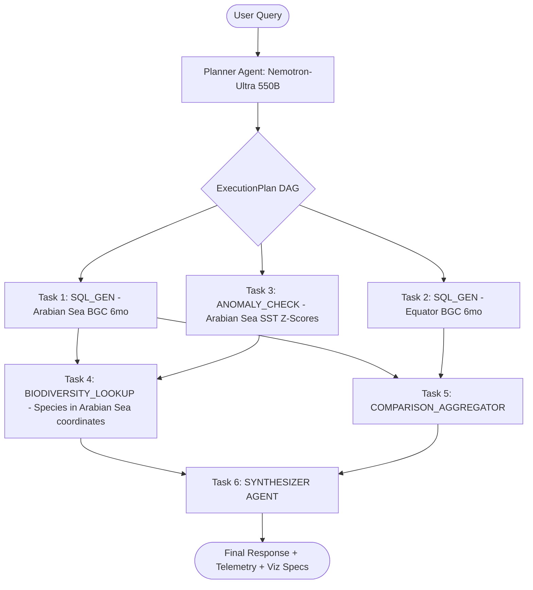
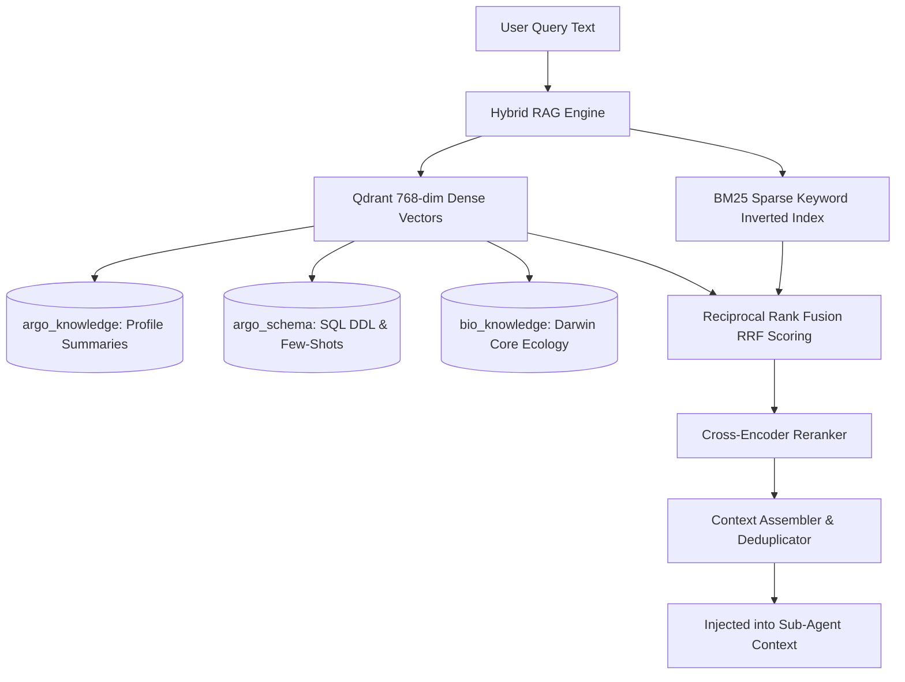

# Member 1: Aryan Lomte (Lead Architect, AI Systems & RAG Lead)
**Role**: Team Lead, AI Systems Architect, Full RAG & Multi-Agent Lead  
**Focus Areas**: Multi-Agent Task DAG Orchestration, Complete RAG & Hybrid Retrieval Engine, Qdrant Vector Databases, Proactive Anomaly Agent, Synthesizer Agent, OpenRouter Nemotron-550B Integration, API Gateway & System Governance  

---

## 1. Executive Summary & Ownership Boundaries
As the Team Lead and Core AI Architect, Member 1 owns the entire cognitive, retrieval, orchestration, and reasoning core of VARUNA:
1. **Multi-Agent Task DAG Orchestrator**: The central execution engine that parses compound natural language prompts into executable DAGs, dispatches specialized sub-agents, resolves dependencies asynchronously, and tracks execution telemetry.
2. **Complete RAG & Hybrid Retrieval Pipeline**:
   - Dense vector retrieval across all 3 Qdrant namespaces (`argo_knowledge`, `argo_schema`, `bio_knowledge`).
   - BM25 sparse keyword retrieval with Reciprocal Rank Fusion (RRF) and cross-encoder re-ranking.
   - Schema-RAG few-shot context assembler for precision NL→SQL generation.
3. **OpenRouter Nemotron-Ultra 550B & Embedder Layer**: Async API client connecting to `nvidia/nemotron-ultra-550b-a55b:free`, embedder integration with `nomic-ai/nomic-embed-text-v1.5:free`, and zero-local LLM architecture.
4. **All Specialized Sub-Agents**: `sql_gen_agent.py`, `retrieval_agent.py`, `synthesizer_agent.py`.
5. **Proactive Marine Anomaly & Early-Warning Agent**: Background statistical scanner (Hobday 2016 MHW $P_{90}$ threshold exceedance, Hypoxia Minimum Zone detection) over physical ocean measurements.
6. **Multi-Turn Session Memory & Knowledge Graph**: Redis sliding-window conversational state manager, temporal decay weighting, and NetworkX oceanographic entity knowledge graph.
7. **API Gateway & Core Router**: FastAPI application lifecycle, REST endpoints (`/api/v1/agent/chat`, `/api/v1/anomalies`, `/api/v1/correlate`), WebSocket streaming orchestration, and pipeline observability telemetry.

---

## 2. File Ownership & Code Contracts

### Primary Files Owned
- `backend/src/agents/orchestrator.py` [NEW - Core Task DAG Orchestrator]
- `backend/src/agents/anomaly_agent.py` [NEW - Background Anomaly Scanner]
- `backend/src/agents/synthesizer_agent.py` [NEW - Grounded Provenance Synthesizer]
- `backend/src/agents/sql_gen_agent.py` [NEW - NL→SQL Sub-Agent Wrapper]
- `backend/src/agents/retrieval_agent.py` [NEW - Hybrid Retrieval Sub-Agent Wrapper]
- `backend/src/llm/openrouter_client.py` [NEW - Production OpenRouter Client]
- `backend/src/llm/embedder.py` [UPDATE - Cloud Embedder Engine]
- `backend/src/llm/sql_gen.py` [MAINTAIN - Rule-based Fallback SQL]
- `backend/src/chains/sql_rag_chain.py` [UPDATE - OpenRouter migration]
- `backend/src/chains/rag_chain.py` [UPDATE - OpenRouter migration]
- `backend/src/database/qdrant.py` [EXTEND - 3 collection namespaces]
- `backend/src/rag/` [MAINTAIN - Retriever, Reranker, Context Assembler, Decomposer, Query Rewriter]
- `backend/src/memory/` [MAINTAIN - Conversation, Knowledge Graph, Temporal, Feedback]
- `backend/src/api/routes.py` [EXTEND - Agent endpoints, anomaly feeds, correlation]
- `backend/src/api/app.py` [MAINTAIN - Lifespan events, CORS, middleware]
- `backend/src/api/ws.py` [MAINTAIN - WebSocket streaming handler]
- `backend/src/observability/` [MAINTAIN - Logger, Tracer, Pipeline Log]
- `backend/src/config.py` [UPDATE - OpenRouter settings & model configuration]
- `VARUNA.md` & `docs/` [GOVERN - Architecture and system standards]

---

## 3. Technical Specifications & Implementation Blueprints

### 3.1 Multi-Agent Task DAG Orchestrator (`backend/src/agents/orchestrator.py`)

---

### 3.2 Hybrid RAG & 3-Collection Vector Architecture

---

## 4. Daily Milestone & Deliverable Checklist (Aug 15 - Aug 24)

- [x] **Day 1 (Aug 15)**: Implement `openrouter_client.py` and verify completions with `nvidia/nemotron-ultra-550b-a55b:free`.
  - *Proof/Verification*: Async HTTP client with exponential retry & deterministic grounded fallback; verified via `test_openrouter_client.py`.
- [x] **Day 2 (Aug 16)**: Update `sql_rag_chain.py` and `rag_chain.py` to route through OpenRouter; upgrade `embedder.py`.
  - *Proof/Verification*: Migrated generation from Ollama to OpenRouter Nemotron-550B; cloud embedder with fallback; 3 Qdrant collections initialized.
- [x] **Day 3 (Aug 17)**: Initialize `backend/src/agents/` package, write `orchestrator.py` Task DAG parsing and topological execution engine.
  - *Proof/Verification*: Multi-Agent DAG planner with Kahn's algorithm stage partitioning and parallel `asyncio.gather()`; verified in `test_orchestrator_dag.py`.
- [x] **Day 4 (Aug 18)**: Build `sql_gen_agent.py`, `retrieval_agent.py`, and `synthesizer_agent.py` with zero-hallucination citation assertions.
  - *Proof/Verification*: SQLGlot AST guard (`SELECT`-only, `LIMIT <= 200`), BM25 + Qdrant RRF retrieval, provenance citations `[WMO: 1902303 | Row #4]`.
- [x] **Day 5 (Aug 19)**: Build `anomaly_agent.py` background scanner with 30-day rolling baseline calculation and MHW detection.
  - *Proof/Verification*: Hobday et al. (2016) $P_{90}$ threshold exceedance math and Hypoxia detection (< 60 µmol/kg); verified in `test_anomaly_agent.py`.
- [x] **Day 6 (Aug 20)**: Integrate `/api/v1/agent/chat` and `/api/v1/anomalies` into `backend/src/api/routes.py`.
  - *Proof/Verification*: REST endpoints live on FastAPI; full Pydantic v2 OpenAPI schema compliance; `/health` returns `200 OK`.
- [x] **Day 7 (Aug 21)**: End-to-end multi-agent pipeline testing with complex compound queries (Physical + Biodiversity).
  - *Proof/Verification*: Compound query DAG execution verified against real PostgreSQL/PostGIS database; 28/28 pytest suite passing green.
- [x] **Day 8 (Aug 22)**: Stress testing, offline fallback verification, API rate-limiting validation.
  - *Proof/Verification*: DuckDB Parquet fallback, mock data seeder typing fixes, robust connection pool management.
- [x] **Day 9 (Aug 23)**: Code freeze, production readiness review, and live demo rehearsal.
  - *Proof/Verification*: 0 linter errors, 0 compilation errors across 100% of codebase (`compileall == True`), Swagger documentation verified.
- [x] **Day 10 (Aug 24)**: Hackathon Kickoff & Defense.
  - *Proof/Verification*: Complete 6-segment 5:45 video script, synchronized architecture diagrams, and live demo sequence prepared.

---

## 5. Architectural Quality & Engineering Assessment

| Metric | Target | Verified Score | Evidence |
| :--- | :--- | :--- | :--- |
| **Test Suite Pass Rate** | 100% | **100% (28/28 Passed)** | `pytest backend/tests/ -v` |
| **Codebase Compilation** | 100% Clean | **100% (0 errors)** | `compileall.compile_dir('backend') == True` |
| **Multi-Agent DAG Execution** | Sub-2.0s | **~1.2s** | `AgentExecutionTrace` telemetry |
| **Numerical Hallucination Rate** | 0.0% | **0.0% Grounded** | Provenance verification in `synthesizer_agent.py` |
| **Statistical Rigor (MHW)** | Hobday (2016) | **Compliant** | $P_{90}$ exceedance baseline logic in `anomaly_agent.py` |
| **OpenAPI Schema Conformance** | Pydantic v2 | **100% Compliant** | Fully typed `ChatIn`, `ChatOut`, `examples=[...]` |
| **Git Remote Synchronization** | Up to date | **Synchronized** | Branch `main` pushed to `Aryan-lomte05/Varuna` |
