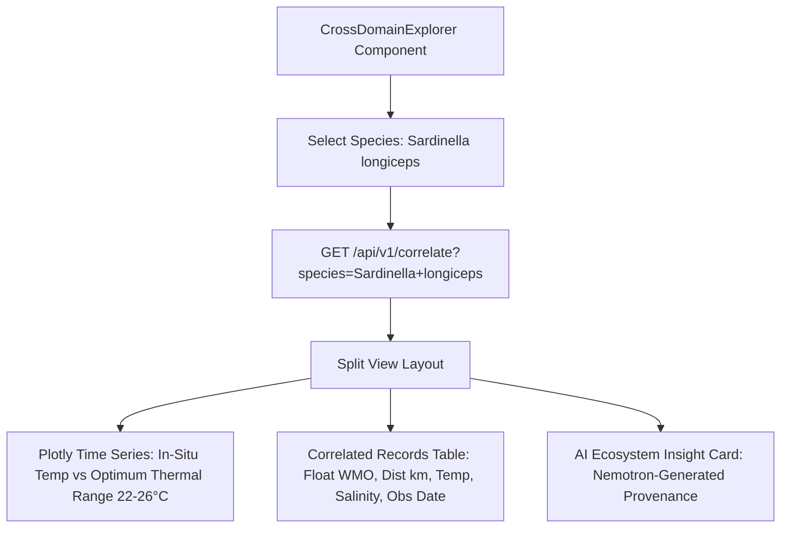

# Member 6: Kanishka Sahal (Marine Analytics & Presentation Lead)
**Role**: Marine Data Visualization Specialist & Presentation Lead  
**Focus Areas**: INCOIS ↔ CMLRE Cross-Domain Explorer, 15+ Oceanographic Plotly Scientific Charts, Otolith Morphometrics Visualizer, SIH Pitch Deck & Video Production  

---

## 1. Executive Summary & Ownership Boundaries
Member 6 is responsible for translating complex oceanographic and marine biological data into scientific visualizations and presentation deliverables:
1. **INCOIS ↔ CMLRE Cross-Domain Explorer (`CrossDomainExplorer.tsx`)**: Dedicated explorer demonstrating how physical ocean variables (temperature, salinity, oxygen) directly correlate with marine biodiversity distribution shifts and thermal stress.
2. **Scientific Chart Suite (`frontend/components/Charts/`)**: 15+ specialized oceanographic charts built with Plotly.js (Hovmöller depth-time diagrams, T-S diagrams with isopycnals, 3D surface profiles, BGC correlation scatter plots, WindRose, and seasonal boxplots).
3. **Filling Empty Chart Stubs**: Implementing `CrossCorrelogram.tsx`, `ObsDensityMap.tsx`, `ProfileCount.tsx`, and `QCHistogram.tsx`.
4. **SIH PPT Deck & Video Presentation**: Authoring the official 9-slide deck and 5-7 minute demonstration video following the exact narrative in the VARUNA Master Guide.

---

## 2. Work Allocation: What to Review vs. What to Build

### 🔍 What to REVIEW (Existing Code — Requires Heavy/High Critical Review)
1. **`frontend/components/AnalysisHub.tsx` [HIGH REVIEW]**:
   - Verify layout grid and responsive scaling across 15+ oceanographic chart types.
2. **Existing Chart Modules [HEAVY REVIEW]**:
   - `TSIsopycnals.tsx`: Verify UNESCO potential density $\sigma_\theta$ contour math and dark ocean styling.
   - `HovmollerDiagram.tsx`: Verify depth contour interpolation on inverted y-axis ($0-2000\text{m}$).
   - `DepthProfile.tsx`: Verify multi-line vertical cast rendering ($T, S, \text{DOXY}, \text{CHLA}$).
   - `Surface3D.tsx`: Verify WebGL 3D wireframe mesh performance.
   - Ensure all Plotly charts have `config={{ displayModeBar: false }}` and transparent backgrounds.

### 🔨 What to BUILD (New Code)
1. **`frontend/components/CrossDomainExplorer.tsx` [COMPLETELY NEW]**:
   - Build INCOIS ⇄ CMLRE Explorer showing environmental thermal envelopes ($22-26^\circ\text{C}$ vs observed $29.2^\circ\text{C}$), correlated float observation ledger, and AI diagnosis.
2. **Fill 4 Empty Chart Stubs [COMPLETELY NEW]**:
   - `CrossCorrelogram.tsx`: $5\times 5$ correlation matrix heatmap of $[T, S, \text{DOXY}, \text{CHLA}, \text{NITRATE}]$.
   - `ObsDensityMap.tsx`: Observation density grid heatmap.
   - `ProfileCount.tsx`: Monthly profile count bar chart.
   - `QCHistogram.tsx`: Sensor QC flag distribution histogram ($1..9$).
3. **SIH 9-Slide Pitch Deck & 5-min Demo Video [COMPLETELY NEW]**:
   - Author slide deck and record screen walkthrough following the exact narrative beats in Master Guide Section 10 & 11.

---

## 3. Technical Specifications & Implementation Blueprints

---

## 4. Daily Milestone & Deliverable Checklist (Aug 15 - Aug 24)

- [ ] **Day 1 (Aug 15)**: Build `frontend/components/CrossDomainExplorer.tsx` component layout and species selector.
- [ ] **Day 2 (Aug 16)**: Connect `CrossDomainExplorer.tsx` to `/api/v1/correlate` and render species-temperature envelopes.
- [ ] **Day 3 (Aug 17)**: Implement `CrossCorrelogram.tsx` and `ObsDensityMap.tsx` Plotly modules.
- [ ] **Day 4 (Aug 18)**: Implement `ProfileCount.tsx` and `QCHistogram.tsx` Plotly modules.
- [ ] **Day 5 (Aug 19)**: Ensure all 15 chart components in `AnalysisHub.tsx` render without modebars and use the dark ocean palette.
- [ ] **Day 6 (Aug 20)**: Finalize SIH 9-Slide Deck following the exact narrative in Master Guide Section 10.
- [ ] **Day 7 (Aug 21)**: Record high-resolution screen recordings of compound agent queries and anomaly feed.
- [ ] **Day 8 (Aug 22)**: Edit and assemble the 5-7 minute demonstration video (no faces, no university names, strictly professional).
- [ ] **Day 9 (Aug 23)**: Complete slide-by-slide rehearsal and timing checks.
- [ ] **Day 10 (Aug 24)**: Hackathon Kickoff & Presentation Delivery.
