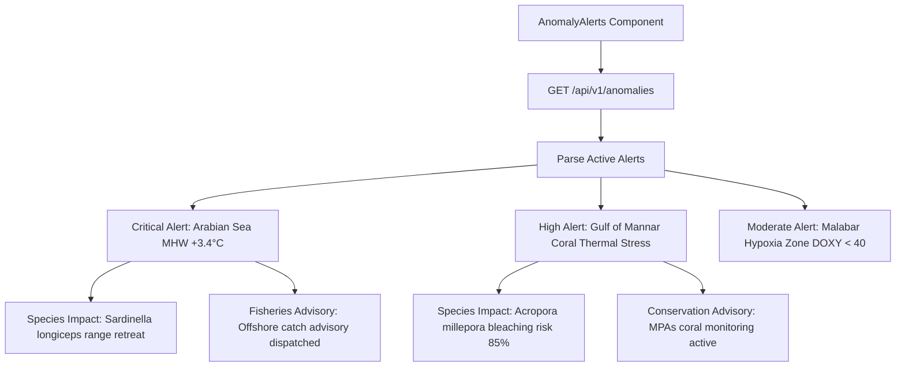

# Member 5: Netal Gupta (Geospatial Systems & Visualization Lead)
**Role**: Geospatial Engineer & Visualization Specialist  
**Focus Areas**: Mapbox GL JS & Deck.gl Geospatial Canvas, ARGO Float Fleet Trajectory Rendering, CMLRE Biodiversity Occurrence Layer, Proactive Anomaly Alert Center UI  

---

## 1. Executive Summary & Ownership Boundaries
Member 5 is responsible for the geospatial situational awareness center of VARUNA:
1. **Interactive Geospatial Canvas (`OceanMap.tsx`)**: High-performance WebGL Deck.gl multi-layer map rendering 3,800+ active ARGO floats, bathymetric contours, and marine basin boundaries.
2. **CMLRE Biodiversity Observation Layer**: Deck.gl `ScatterplotLayer` rendering species occurrence records with color-coded taxonomic groupings and radius scaled to individual count.
3. **Float Trajectory Visualization (`TrajectoryLayer.tsx`)**: 90-day to 365-day historical drift tracks using Deck.gl `PathLayer` with gradient depth/time encoding.
4. **Proactive Anomaly & Early-Warning Center (`AnomalyAlerts.tsx`)**: Dedicated situational awareness feed displaying active Marine Heatwave alerts, hypoxia zones, affected marine species, and fisheries policy advisories.

---

## 2. Work Allocation: What to Review vs. What to Build

### 🔍 What to REVIEW (Existing Code — Requires Heavy/High Critical Review)
1. **`frontend/components/OceanMap.tsx` [HEAVY REVIEW]**:
   - Verify Deck.gl `ScatterplotLayer` performance under 3,800+ float nodes.
   - Implement vertical depth scrubber slider ($0\text{m} \to 2000\text{m}$) filtering measurements by depth layer.
   - Add toggleable CMLRE species observation layer with taxonomic color scales.
2. **`frontend/components/Map/TrajectoryLayer.tsx` [HIGH REVIEW]**:
   - Verify animated gradient drift paths for tracked ARGO floats and check for memory leaks on long trajectories.
3. **`frontend/components/Map/FloatMap.tsx` [HIGH REVIEW]**:
   - Inspect popup marker layout to ensure clean in-situ temperature, salinity, and BGC metric rendering.

### 🔨 What to BUILD (New Code)
1. **`frontend/components/AnomalyAlerts.tsx` [COMPLETELY NEW]**:
   - Early-Warning Situational Room with card feeds of active Marine Heatwaves (Hobday 2016), climatological baseline curves, vulnerable species impact badges, and 1-click fisheries advisory export.

---

## 3. Technical Specifications & Implementation Blueprints

---

## 4. Daily Milestone & Deliverable Checklist (Aug 15 - Aug 24)

- [ ] **Day 1 (Aug 15)**: Implement `frontend/components/AnomalyAlerts.tsx` UI skeleton with severity badges and glassmorphic cards.
- [ ] **Day 2 (Aug 16)**: Connect `AnomalyAlerts.tsx` to `/api/v1/anomalies` REST endpoint with auto-polling every 5 minutes.
- [ ] **Day 3 (Aug 17)**: Add CMLRE species observation layer toggle button to `OceanMap.tsx`.
- [ ] **Day 4 (Aug 18)**: Build Deck.gl `ScatterplotLayer` for species occurrences with custom taxonomic color scales.
- [ ] **Day 5 (Aug 19)**: Enhance `TrajectoryLayer.tsx` with animated gradient drift paths for tracked ARGO floats.
- [ ] **Day 6 (Aug 20)**: Implement interactive Map Tooltips displaying in-situ temperature, salinity, and species metadata on hover.
- [ ] **Day 7 (Aug 21)**: Add ocean basin boundary polygon outlines (Arabian Sea, Bay of Bengal, Gulf of Mannar).
- [ ] **Day 8 (Aug 22)**: Performance tuning: verify 60 FPS pan/zoom with 10,000 combined data points.
- [ ] **Day 9 (Aug 23)**: Cross-browser geospatial rendering validation (Chrome, Edge, Firefox, Safari).
- [ ] **Day 10 (Aug 24)**: Hackathon Kickoff & Live Map Defense.
