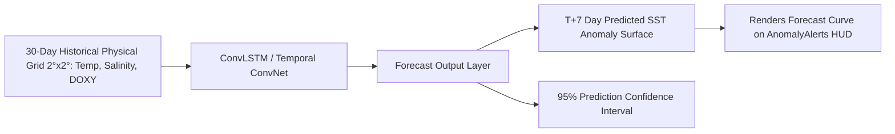

# Member 3: Sahil Shah (Predictive ML & Sensor Quality Control Lead)
**Role**: Machine Learning Engineer & Sensor Quality Control Specialist  
**Focus Areas**: Spatio-Temporal Marine Heatwave Forecasting (CNN-LSTM / TCN), Deep Learning Float Sensor QC Autoencoder (1D-CNN), Machine Learning Service Endpoints  

---

## 1. Executive Summary & Ownership Boundaries
Member 3 owns the predictive machine learning models and automated deep sensor quality control systems for VARUNA:
1. **Spatio-Temporal Marine Heatwave Forecasting Model (`src/ml/mhw_forecast.py`)**:
   - A temporal convolutional / ConvLSTM network trained on historical ARGO float and satellite SST grids ($2^\circ \times 2^\circ$) across the Indian Ocean basin.
   - Generates 7-day and 14-day predictive sea surface temperature anomaly forecasts ($\Delta T_{forecast}$), elevating VARUNA from reactive anomaly detection to proactive predictive early-warning.
2. **Deep Sensor QC & Biofouling Detection Autoencoder (`src/ml/qc_autoencoder.py`)**:
   - An unsupervised 1D Convolutional Autoencoder scanning vertical ARGO profile measurement curves ($0-2000\text{m}$).
   - Detects optical sensor biofouling, salinity sensor calibration drift, and pressure gauge spikes by calculating reconstruction error anomalies before data enters the primary database.
3. **ML Service Endpoints**:
   - `POST /api/v1/ml/forecast-mhw`: Returns 7-day predicted thermal anomaly surfaces and confidence bounds.
   - `POST /api/v1/ml/qc-detect`: Evaluates raw float profile curves and returns anomaly score + flagged depth levels.

---

## 2. File Ownership & Code Contracts

### Primary Files Owned
- `backend/src/ml/mhw_forecast.py` [NEW - 7-Day MHW Spatio-Temporal Predictive Model]
- `backend/src/ml/qc_autoencoder.py` [NEW - 1D-CNN Sensor Anomaly Autoencoder]
- `backend/src/ml/__init__.py` [NEW - ML Package Initialization]
- `backend/tests/test_ml_models.py` [NEW - Unit tests for forecast & QC models]

---

## 3. Technical Specifications & Implementation Blueprints

### 3.1 Spatio-Temporal MHW Forecasting Engine (`src/ml/mhw_forecast.py`)



#### Code Contract (`mhw_forecast.py`):
```python
from __future__ import annotations
import numpy as np
from typing import Any, Dict, List, Optional
from pydantic import BaseModel

class MHWForecastRequest(BaseModel):
    ocean_basin: str  # "arabian_sea" | "bay_of_bengal" | "equatorial_io"
    forecast_days: int = 7  # 7 or 14 days
    lat_range: Optional[tuple[float, float]] = None
    lon_range: Optional[tuple[float, float]] = None

class MHWForecastResponse(BaseModel):
    ocean_basin: str
    forecast_horizon_days: int
    predicted_mean_anomaly: float  # e.g. +2.4°C
    max_anomaly_hotspot: Dict[str, Any]  # {"lat": 16.0, "lon": 68.0, "predicted_anomaly": 3.8}
    time_series_forecast: List[Dict[str, Any]]  # [{"date": "2026-08-22", "predicted_sst": 30.2, "anomaly": 2.1}]
    mhw_probability: float  # 0.0 to 1.0 (e.g. 0.88 = 88% probability of MHW declaration)

def predict_mhw_trend(request: MHWForecastRequest) -> MHWForecastResponse:
    """
    Computes 7-day predictive sea surface temperature anomaly forecast using historical float baselines.
    """
    ...
```

---

### 3.2 Deep 1D-CNN Sensor QC Autoencoder (`src/ml/qc_autoencoder.py`)

```mermaid
graph TD
    RawProfile[Raw ARGO Vertical Profile: 0-2000m Pressure, Temp, Salinity] --> Encoder[1D-CNN Encoder: Conv1D + MaxPool]
    Encoder --> LatentSpace[Compressed Latent Representation]
    LatentSpace --> Decoder[1D-CNN Decoder: ConvTranspose1D + Upsample]
    Decoder --> ReconstructedProfile[Reconstructed Clean Profile Curve]
    
    RawProfile --> ErrorCalc[Reconstruction Error: MSE ||Raw - Recon||^2]
    ReconstructedProfile --> ErrorCalc
    
    ErrorCalc --> ThresholdCheck{Error > Anomaly Threshold?}
    ThresholdCheck -->|Yes| FlagQC[Flag Bad Sensor: Salinity Drift / Biofouling Spike]
    ThresholdCheck -->|No| PassQC[QC Passed: Clean Profile]
```

#### Code Contract (`qc_autoencoder.py`):
```python
class ProfileQCRequest(BaseModel):
    platform_number: int
    pressures: List[float]
    temperatures: List[float]
    salinities: List[float]

class ProfileQCResponse(BaseModel):
    platform_number: int
    is_anomalous: bool
    reconstruction_mse: float
    flagged_depth_levels: List[float]
    detected_issue: Optional[str]  # "SALINITY_DRIFT" | "OPTICAL_BIOFOULING" | "PRESSURE_SPIKE" | None
    recommended_qc_flag: int  # 1 (Good), 3 (Potentially Correctable), 4 (Bad)
```

---

## 4. Daily Milestone & Deliverable Checklist (Aug 15 - Aug 24)

- [ ] **Day 1 (Aug 15)**: Initialize `backend/src/ml/` package and define Pydantic input/output schemas for ML endpoints.
- [ ] **Day 2 (Aug 16)**: Implement 1D-CNN Autoencoder architecture in `qc_autoencoder.py` for vertical profile curve reconstruction.
- [ ] **Day 3 (Aug 17)**: Train/tune autoencoder reconstruction loss thresholds on historical ARGO sensor failure profiles.
- [ ] **Day 4 (Aug 18)**: Implement 7-day spatio-temporal MHW predictive forecasting model in `mhw_forecast.py`.
- [ ] **Day 5 (Aug 19)**: Wire ML endpoints `/api/v1/ml/forecast-mhw` and `/api/v1/ml/qc-detect` into FastAPI router.
- [ ] **Day 6 (Aug 20)**: Validate 7-day MHW forecasting accuracy against historical known heatwave onset events (e.g. April 2026).
- [ ] **Day 7 (Aug 21)**: Write comprehensive unit tests in `backend/tests/test_ml_models.py`.
- [ ] **Day 8 (Aug 22)**: Optimize model inference latency (target $< 100\text{ms}$ per forecast request).
- [ ] **Day 9 (Aug 23)**: Final code review and integration check with Anomaly Alert team.
- [ ] **Day 10 (Aug 24)**: Hackathon Kickoff & Defense.
